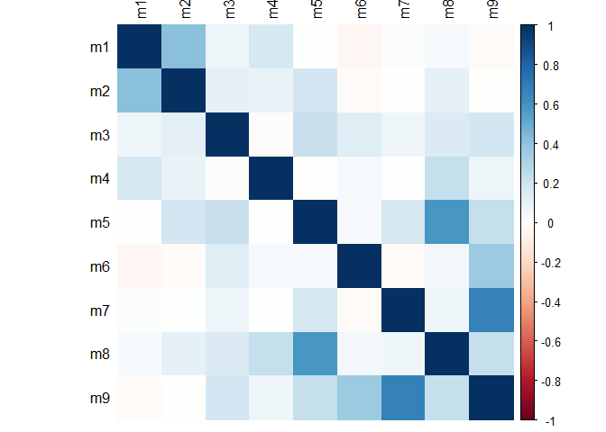
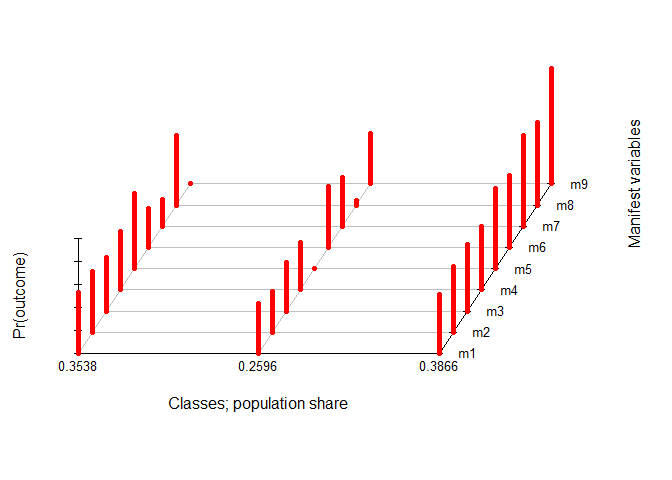
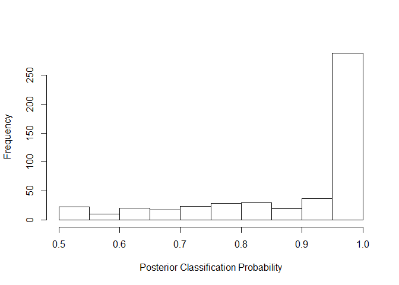

LCA for mixtures example
================
Rachel Carroll
June 5, 2019

This is a simulated example of using latent class analysis in the area of chemical mixtures modeling. This example is referred to in a paper entitled "Latent classes for chemical mixtures analyses in epidemiology: An example using phthlate and phenol exposure biomarkers in pregnant women" by Carroll R. et. al.

The following chunk of R code is for reading in the simulated data so that you can run the example. The data includes 3 continuous covariates (x1, x2, and x3), nine moderately correlated chemical measures (m1-m9), and a continuous outcome (y).

``` r
ExData=read.csv("ExData.csv")
attach(ExData)
n=dim(ExData)[1]
```

As our first step of analysis, we will examine the correlation matrix of the chemicals. This is done with the corrplot package in R. From these results, we can see that −0.04 &lt; *ρ* &lt; 0.67. The chemical pairs with the highest amount of correlation include (m1,m2), (m5,m8), and (m7,m9). This indicates little to moderate correlation in the chemicals presented here.

``` r
library(corrplot)
```

    ## Warning: package 'corrplot' was built under R version 3.4.4

    ## corrplot 0.84 loaded

``` r
round(cor(ExData[,5:13]),2)
```

    ##       m1    m2    m3    m4   m5    m6    m7   m8    m9
    ## m1  1.00  0.41  0.07  0.18 0.00 -0.04  0.01 0.03 -0.03
    ## m2  0.41  1.00  0.11  0.10 0.19 -0.02  0.00 0.11 -0.01
    ## m3  0.07  0.11  1.00 -0.01 0.22  0.14  0.08 0.16  0.18
    ## m4  0.18  0.10 -0.01  1.00 0.00  0.04  0.01 0.23  0.07
    ## m5  0.00  0.19  0.22  0.00 1.00  0.03  0.18 0.58  0.23
    ## m6 -0.04 -0.02  0.14  0.04 0.03  1.00 -0.03 0.05  0.36
    ## m7  0.01  0.00  0.08  0.01 0.18 -0.03  1.00 0.06  0.67
    ## m8  0.03  0.11  0.16  0.23 0.58  0.05  0.06 1.00  0.24
    ## m9 -0.03 -0.01  0.18  0.07 0.23  0.36  0.67 0.24  1.00

``` r
corrplot(cor(ExData[,5:13]),method="color",tl.col="black")
```



Now we will perform the LCA. The first step of this involves dichotomizing the chemicals such that 1 indicates a below the median measure of the chemical and 2 indictes an above the median measure of the chemical. You will get an error if you dichotomize as 0/1.

``` r
catchems=ExData[,5:13]
for (i in 1:9){
  catchems[,i]=ifelse(ExData[,4+i]<median(ExData[,4+i]),1,2)
}
```

The next step of the LCA procedure requires selecting the appropriate number of classes. The poLCA function can estimate several measures of goodness of fit (log likelihood, AIC, BIC, *G*<sup>2</sup>, and *χ*<sup>2</sup>) for this purpose. The next chunk of code performs the LCA in a for loop for class sizes 2-10 and stores the goodness of fit measures to a matrix object named gof. Some description of the code follows.

The object f is the input formula required by the poLCA function. This formula column binds the 9 chemicals (m1-m9) to the left of the ~ to indicate that these are the manifest variables for the LCA. The 1 to the left of the ~ means that we are not adjusting for any covariates in this implementation of LCA. Covariate adjusted LCA could be implemented by replacing the 1 with x1+x2 (or similar).

A seed must be set here to guarentee that the same results are produced. Results for poLCA (and most LCA software) differ because the method requires the use of an algorithm in which convergence must be met. poLCA uses the EM algorithm for this purpose.

For all of the goodness of fit measures, a smaller magnitude indicates a better fitting model. Using the formattable package, we can create a table that nicely displays the best number for each criterion. The goodness of fit results here suggest that the three class model will be the best. Similarly to the results in the paper, this number of classes was indicated as best for one of the criterion (BIC), and we believe that it would be the most interpretable.

``` r
f<-cbind(m1,m2,m3,m4,m5,m6,m7,m8,m9)~1
gof=matrix(1,9,6)
colnames(gof)<-c("k=","llik","AIC","BIC","Gsq","Chisq")
for (i in 2:10){
  set.seed(05162018)
  res=poLCA(f,as.data.frame(catchems),graphs = F,nclass=i,verbose=F)
  gof[i-1,]=c(i,res$llik,res$aic,res$bic,res$Gsq,res$Chisq)
}
min_bold <- formatter("span", 
  style = x ~ style("font-weight" = ifelse(abs(x) == min(abs(x)), "bold", NA)))
formattable(as.data.frame(gof),
            list(llik=min_bold,AIC=min_bold,BIC=min_bold,Gsq=min_bold,Chisq=min_bold))
```

<table class="table table-condensed">
<thead>
<tr>
<th style="text-align:right;">
k=
</th>
<th style="text-align:right;">
llik
</th>
<th style="text-align:right;">
AIC
</th>
<th style="text-align:right;">
BIC
</th>
<th style="text-align:right;">
Gsq
</th>
<th style="text-align:right;">
Chisq
</th>
</tr>
</thead>
<tbody>
<tr>
<td style="text-align:right;">
2
</td>
<td style="text-align:right;">
<span>-3056.222</span>
</td>
<td style="text-align:right;">
<span>6150.444</span>
</td>
<td style="text-align:right;">
<span>6230.521</span>
</td>
<td style="text-align:right;">
<span>691.8357</span>
</td>
<td style="text-align:right;">
<span>653.1399</span>
</td>
</tr>
<tr>
<td style="text-align:right;">
3
</td>
<td style="text-align:right;">
<span>-2993.575</span>
</td>
<td style="text-align:right;">
<span>6045.151</span>
</td>
<td style="text-align:right;">
<span style="font-weight: bold">6167.375</span>
</td>
<td style="text-align:right;">
<span>566.5428</span>
</td>
<td style="text-align:right;">
<span>525.1544</span>
</td>
</tr>
<tr>
<td style="text-align:right;">
4
</td>
<td style="text-align:right;">
<span>-2975.696</span>
</td>
<td style="text-align:right;">
<span>6029.393</span>
</td>
<td style="text-align:right;">
<span>6193.763</span>
</td>
<td style="text-align:right;">
<span>530.7848</span>
</td>
<td style="text-align:right;">
<span>492.4118</span>
</td>
</tr>
<tr>
<td style="text-align:right;">
5
</td>
<td style="text-align:right;">
<span>-2955.636</span>
</td>
<td style="text-align:right;">
<span>6009.272</span>
</td>
<td style="text-align:right;">
<span>6215.788</span>
</td>
<td style="text-align:right;">
<span>490.6639</span>
</td>
<td style="text-align:right;">
<span>471.0540</span>
</td>
</tr>
<tr>
<td style="text-align:right;">
6
</td>
<td style="text-align:right;">
<span>-2944.972</span>
</td>
<td style="text-align:right;">
<span style="font-weight: bold">6007.944</span>
</td>
<td style="text-align:right;">
<span>6256.606</span>
</td>
<td style="text-align:right;">
<span>469.3363</span>
</td>
<td style="text-align:right;">
<span>428.0291</span>
</td>
</tr>
<tr>
<td style="text-align:right;">
7
</td>
<td style="text-align:right;">
<span>-2937.187</span>
</td>
<td style="text-align:right;">
<span>6012.373</span>
</td>
<td style="text-align:right;">
<span>6303.181</span>
</td>
<td style="text-align:right;">
<span>453.7652</span>
</td>
<td style="text-align:right;">
<span>423.0784</span>
</td>
</tr>
<tr>
<td style="text-align:right;">
8
</td>
<td style="text-align:right;">
<span>-2926.929</span>
</td>
<td style="text-align:right;">
<span>6011.858</span>
</td>
<td style="text-align:right;">
<span>6344.812</span>
</td>
<td style="text-align:right;">
<span>433.2498</span>
</td>
<td style="text-align:right;">
<span>401.2228</span>
</td>
</tr>
<tr>
<td style="text-align:right;">
9
</td>
<td style="text-align:right;">
<span>-2922.029</span>
</td>
<td style="text-align:right;">
<span>6022.058</span>
</td>
<td style="text-align:right;">
<span>6397.158</span>
</td>
<td style="text-align:right;">
<span>423.4499</span>
</td>
<td style="text-align:right;">
<span>379.5120</span>
</td>
</tr>
<tr>
<td style="text-align:right;">
10
</td>
<td style="text-align:right;">
<span style="font-weight: bold">-2912.658</span>
</td>
<td style="text-align:right;">
<span>6023.315</span>
</td>
<td style="text-align:right;">
<span>6440.562</span>
</td>
<td style="text-align:right;">
<span style="font-weight: bold">404.7073</span>
</td>
<td style="text-align:right;">
<span style="font-weight: bold">375.4800</span>
</td>
</tr>
</tbody>
</table>
Now that we've determined the ideal number of classes (3), we can perform the LCA for that particular model and use the results.

``` r
set.seed(05162018)
res=poLCA(f,as.data.frame(catchems),graphs = T,nclass=3)
```



    ## Conditional item response (column) probabilities,
    ##  by outcome variable, for each class (row) 
    ##  
    ## $m1
    ##            Pr(1)  Pr(2)
    ## class 1:  0.4684 0.5316
    ## class 2:  0.5637 0.4363
    ## class 3:  0.4862 0.5138
    ## 
    ## $m2
    ##            Pr(1)  Pr(2)
    ## class 1:  0.4734 0.5266
    ## class 2:  0.6430 0.3570
    ## class 3:  0.4283 0.5717
    ## 
    ## $m3
    ##            Pr(1)  Pr(2)
    ## class 1:  0.5321 0.4679
    ## class 2:  0.5739 0.4261
    ## class 3:  0.4210 0.5790
    ## 
    ## $m4
    ##            Pr(1)  Pr(2)
    ## class 1:  0.4907 0.5093
    ## class 2:  0.5910 0.4090
    ## class 3:  0.4475 0.5525
    ## 
    ## $m5
    ##            Pr(1)  Pr(2)
    ## class 1:  0.3500 0.6500
    ## class 2:  1.0000 0.0000
    ## class 3:  0.3016 0.6984
    ## 
    ## $m6
    ##            Pr(1)  Pr(2)
    ## class 1:  0.6573 0.3427
    ## class 2:  0.4714 0.5286
    ## class 3:  0.3753 0.6247
    ## 
    ## $m7
    ##            Pr(1)  Pr(2)
    ## class 1:  0.7653 0.2347
    ## class 2:  0.5720 0.4280
    ## class 3:  0.2088 0.7912
    ## 
    ## $m8
    ##            Pr(1)  Pr(2)
    ## class 1:  0.3983 0.6017
    ## class 2:  0.9600 0.0400
    ## class 3:  0.2843 0.7157
    ## 
    ## $m9
    ##            Pr(1)  Pr(2)
    ## class 1:  1.0000 0.0000
    ## class 2:  0.5631 0.4369
    ## class 3:  0.0000 1.0000
    ## 
    ## Estimated class population shares 
    ##  0.3538 0.2596 0.3866 
    ##  
    ## Predicted class memberships (by modal posterior prob.) 
    ##  0.31 0.324 0.366 
    ##  
    ## ========================================================= 
    ## Fit for 3 latent classes: 
    ## ========================================================= 
    ## number of observations: 500 
    ## number of estimated parameters: 29 
    ## residual degrees of freedom: 471 
    ## maximum log-likelihood: -2993.575 
    ##  
    ## AIC(3): 6045.151
    ## BIC(3): 6167.375
    ## G^2(3): 566.5428 (Likelihood ratio/deviance statistic) 
    ## X^2(3): 525.1544 (Chi-square goodness of fit) 
    ## 

``` r
assignLCA3=res$predclass
table(assignLCA3)
```

    ## assignLCA3
    ##   1   2   3 
    ## 155 162 183

``` r
postprobsMat=round(res$posterior,2)
postprobsVec=rep(0,n)
for (i in 1:n){postprobsVec[i]=postprobsMat[i,assignLCA3[i]]}
summary(postprobsVec)
```

    ##    Min. 1st Qu.  Median    Mean 3rd Qu.    Max. 
    ##  0.5100  0.8000  0.9950  0.8944  1.0000  1.0000

``` r
hist(postprobsVec,main="",xlab="Posterior Classification Probability")
```


